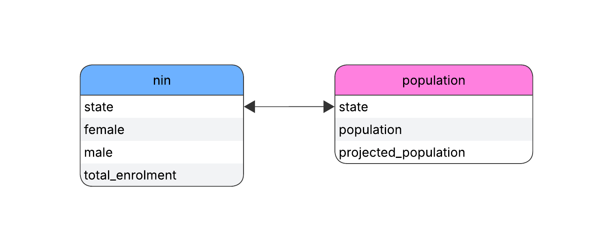

# NIN-Enrollment-Coverage-in-Nigeria
An analytical study of NIN enrolment coverage across Nigerian states using publicly available data and population projections with analysis performed in Excel and PostgreSQL to access coverage gaps, gender disparity and how enrolment compares to projected population in 2025.

# Table Of Contents
1. Introduction
2. Data Sources
3. Data Models and Tables
4. Methodology
5. Key Analysis Questions
6. SQL Queries and Results
7. Anomaly Detection
8. Limitations
9. Reproducibility Notes

# Introduction

<p>This project analyzes National Identification Number (NIN) enrollment data across Nigerian states and compares enrollment counts with projected population figures.  </p>The National Identification Number (NIN) is a unique identifier issued by the National Identity Management Commission (NIMC) to Nigerian citizens and legal residents. </p>As a foundational identity system, NIN enrollment coverage is critical for effective service delivery, governance, and demographic planning.The objective of this analysis is to assess enrollment coverage gaps across states, examine gender disparities in enrollment, identify anomalies where total enrollments exceed projected population figures, and explore structural factors such as diaspora records and reporting boundaries that may influence these outcomes.

# Data Sources

I used publicly available data from official government sources:
1. [NIN Enrollment Data by State](https://nimc.gov.ng/nin/enrolment-report/june-2025)
2. [Population Data by State](https://www.nigerianstat.gov.ng/download/1241121)


*Relationship Diagram created in lucid.app*

# Data Models and Tables

## Tables

### Table 1- nin
### Columns
* state - TEXT, NOT NULL
* female - NUMERIC, NOT NULL
* male - NUMERIC, NOT NULL
* total_enrolment - NUMERIC, NOT NULL


| state       | female  | male    | total_enrolment |
|-------------|---------|---------|-----------------|
| Abia        | 1027850 | 1659279 | 2687129         |
| Adamawa     | 1288294 | 1796528 | 3084822         |
| Akwa_Ibom   | 1026087 | 1172684 | 2198771         |
| Anambra     | 1410739 | 1527768 | 2938507         |
| Bauchi      | 1184359 | 1968299 | 3152658         |
| Bayelsa     | 357333  | 434230  | 791563          |
| Benue       | 1215583 | 1582083 | 2797666         |
| Borno       | 1319833 | 1713395 | 3033228         |
| Cross_River | 642326  | 770015  | 1412341         |
| Delta       | 1554473 | 1737785 | 3292258         |
| Ebonyi      | 466272  | 551666  | 1017938         |
| Edo         | 1265576 | 1470635 | 2736211         |
| Ekiti       | 584596  | 574946  | 1159542         |
| Enugu       | 986173  | 1006217 | 1992390         |
| FCT_Abuja   | 1651031 | 2313935 | 3964966         |
| Gombe       | 874587  | 1239957 | 2114544         |
| Imo         | 1008825 | 1067262 | 2076087         |
| Jigawa      | 1314104 | 1855159 | 3169263         |
| Kaduna      | 3210866 | 3948785 | 7159651         |
| Kano        | 4667448 | 6412416 | 11079864        |
| Katsina     | 1711668 | 2433992 | 4145660         |
| Kebbi       | 970272  | 1633240 | 2603512         |
| Kogi        | 899241  | 1031191 | 1930432         |
| Kwara       | 938869  | 1112621 | 2051490         |
| Lagos       | 5870729 | 7033431 | 12904160        |
| Nasarawa    | 993619  | 1340965 | 2334584         |
| Niger       | 1169857 | 1839731 | 3009588         |
| Ogun        | 2421450 | 2642286 | 5063736         |
| Ondo        | 1116994 | 1193108 | 2310102         |
| Osun        | 1127733 | 1152025 | 2279758         |
| Oyo         | 2240320 | 2427178 | 4667498         |
| Plateau     | 1149273 | 1289992 | 2439265         |
| Rivers      | 1651947 | 1967704 | 3619651         |
| Sokoto      | 824751  | 1882420 | 2707171         |
| Taraba      | 740969  | 1102506 | 1843475         |
| Yobe        | 722320  | 1202707 | 1925027         |
| Zamfara     | 736981  | 1444838 | 2181819         |
| Diaspora    | 579861  | 948413  | 1528274         |


### Table 2- population
### Columns
* state
* population
* projected_population


| state       | population | projected_population |
|-------------|------------|----------------------|
| Abia        | 3841943    | 4455476              |
| Adamawa     | 4536948    | 5261469              |
| Akwa_Ibom   | 4780581    | 5544008              |
| Anambra     | 5599910    | 6494179              |
| Bauchi      | 7540663    | 8744857              |
| Bayelsa     | 2394725    | 2777147              |
| Benue       | 5787706    | 6711965              |
| Borno       | 5751590    | 6670081              |
| Cross_River | 4175020    | 4841743              |
| Delta       | 5307543    | 6155123              |
| Ebonyi      | 3007155    | 3487378              |
| Edo         | 4461137    | 5173551              |
| Ekiti       | 3350401    | 3885438              |
| Enugu       | 4396098    | 5098126              |
| FCT_Abuja   | 2702443    | 3134005              |
| Gombe       | 3623462    | 4202105              |
| Imo         | 5167722    | 5992973              |
| Jigawa      | 6779080    | 7861654              |
| Kaduna      | 8324285    | 9653619              |
| Kano        | 14253549   | 16529747             |
| Katsina     | 9300382    | 10785592             |
| Kebbi       | 5001610    | 5800334              |
| Kogi        | 4153734    | 4817058              |
| Kwara       | 3259613    | 3780152              |
| Lagos       | 12772884   | 14812630             |
| Nasarawa    | 2632239    | 3052590              |
| Niger       | 6220617    | 7214009              |
| Ogun        | 5945275    | 6894696              |
| Ondo        | 4969707    | 5763336              |
| Osun        | 4237396    | 4914080              |
| Oyo         | 7512855    | 8712608              |
| Plateau     | 4400974    | 5103781              |
| Rivers      | 7034973    | 8158412              |
| Sokoto      | 5863187    | 6799499              |
| Taraba      | 3331885    | 3863965              |
| Yobe        | 3398177    | 3940844              |
| Zamfara     | 5317793    | 6167010              |
| Diaspora    | 17000000   | 17000000             |

### Data Relationships

- The `state` column serves as the join key, common to both tables for direct comparison between enrollment and population estimates.

- A `Diaspora` row is included for uniformity:
  - Uses a single population value for both `population` and `projected_population`
  - Prevents null or zero-division errors during ratio calculations
  - Allows diaspora records to exist while being selectively excluded from state-level comparisons

# Methodology

## Data Processing & Analysis

**NIN Enrollment Data:**  
NIN enrollment figures were obtained from the NIMC website, cleaned and standardized in Excel, and then imported into PostgreSQL for analysis.

**Population Projections:**  
Population figures were projected from the base census year using a constant annual growth rate of 2.5%. The projection calculations were performed in Excel to ensure transparency and reproducibility, after which the results were imported into PostgreSQL.

**Analysis:**  
Analytical queries were executed in PostgreSQL to compute enrollment totals, gender distributions, and coverage ratios. Diaspora records were excluded from specific analyses—such as rankings of best- and worst-performing states—because they do not represent a geographic state within Nigeria.


# Key Analysis Questions

- Which are the 10 best and worst performing states based on total nin enrolment?
- How does female enrollment compare to total enrollment across states?
- What proportion of each state's projected population has been enrolled for NIN, and where do significant coverage gaps or anomalies exist?
- Which states exceed 100% coverage?

# NIN Enrollment Coverage Analysis

## Question
Which are the 10 best- and worst-performing states based on total nin enrolment?


---

## Top 10 Best-Performing States
```sql
-- Retrieve the 10 states with highest NIN enrollment
SELECT 
    state,
    total_enrolment
FROM nin
WHERE state <> 'Diaspora'
ORDER BY total_enrolment DESC
LIMIT 10;
```

**Query Logic:**
1. Select state and enrollment columns
2. Exclude 'Diaspora' records (non-state entity)
3. Sort by enrollment in descending order
4. Return top 10 results

---

### Results

| state     | total_enrolment |
|-----------|-----------------|
| Lagos     | 12904160        |
| Kano      | 11079864        |
| Kaduna    | 7159651         |
| Ogun      | 5063736         |
| Oyo       | 4667498         |
| Katsina   | 4145660         |
| FCT_Abuja | 3964966         |
| Rivers    | 3619651         |
| Delta     | 3292258         |
| Jigawa    | 3169263         |

---

### Visualization


*Figure 1: States with highest NIN enrollment numbers*

### Top 10 States by NIN Enrollment — Observation

This result reflects absolute enrollment totals only and does not account for population size or coverage adequacy, which are examined in subsequent analyses.


## Top 10 Worst-Performing States
```sql
-- Retrieve the 10 states with lowest NIN enrollment
SELECT 
    state,
    total_enrolment
FROM nin
WHERE state <> 'Diaspora'
ORDER BY total_enrolment ASC
LIMIT 10;
```

**Query Logic:**
1. Select state and enrollment columns
2. Exclude 'Diaspora' records (non-state entity)
3. Sort by enrollment in ascending order
4. Return bottom 10 results

### Results

| state       | total_enrolment |
|-------------|-----------------|
| Bayelsa     | 791563          |
| Ebonyi      | 1017938         |
| Ekiti       | 1159542         |
| Cross_River | 1412341         |
| Taraba      | 1843475         |
| Yobe        | 1925027         |
| Kogi        | 1930432         |
| Enugu       | 1992390         |
| Kwara       | 2051490         |
| Imo         | 2076087         |

### Visualization


*Figure 2: States with lowest NIN enrollment numbers*

### Bottom 10 States by NIN Enrollment — Observation
This ranking reflects the states with the lowest absolute NIN enrollment totals and does not account for population size or coverage adequacy, which are addressed in subsequent analyses.

---

# Female Enrollment Analysis by State

## Question
What is the female enrollment percentage per state including diaspora?

---

### SQL Query
```sql
-- Calculate female enrollment percentage for all states including diaspora
SELECT 
    state,
    ROUND((female * 100 / total_enrolment) AS female_percentage
FROM nin
WHERE total_enrolment > 0
ORDER BY female_percentage DESC;
```

### Query Logic

1. Select the state and calculate female enrollment percentage
   - Divide `female` by `total_enrolment`
   - Multiply by `100`
2. Use `ROUND()`
3. Alias the calculated column as `female_percentage`
4. Filter out records with zero enrollment to prevent errors
5. Order results by `female_percentage` in descending order

---

| state       | female_percentage |
|-------------|-------------------|
| Ekiti       | 50                |
| Imo         | 49                |
| Osun        | 49                |
| Enugu       | 49                |
| Ogun        | 48                |
| Ondo        | 48                |
| Oyo         | 48                |
| Anambra     | 48                |
| Plateau     | 47                |
| Akwa_Ibom   | 47                |
| Delta       | 47                |
| Kogi        | 47                |
| Ebonyi      | 46                |
| Rivers      | 46                |
| Kwara       | 46                |
| Edo         | 46                |
| Cross_River | 45                |
| Lagos       | 45                |
| Kaduna      | 45                |
| Bayelsa     | 45                |
| Borno       | 44                |
| Benue       | 43                |
| Nasarawa    | 43                |
| Adamawa     | 42                |
| Kano        | 42                |
| FCT_Abuja   | 42                |
| Katsina     | 41                |
| Jigawa      | 41                |
| Gombe       | 41                |
| Taraba      | 40                |
| Niger       | 39                |
| Diaspora    | 38                |
| Bauchi      | 38                |
| Yobe        | 38                |
| Abia        | 38                |
| Kebbi       | 37                |
| Zamfara     | 34                |
| Sokoto      | 30                |

---

### Visualization


*Figure 3: Female Enrolment Analysis by State*

### Female NIN Enrollment Distribution — Observation

Female enrollment proportions exhibit limited variation across states, remaining below 50% in almost all cases except one state and concentrated primarily between 30% and 49%.

---

# NIN Enrollment vs Projected Population by State

## Question
What are the reported NIN total enrollment and projected population by state?

---

## SQL Query
```sql
-- Join NIN enrollment data with population projections
SELECT 
    nin.state,
    nin.total_enrolment,
    population.projected_population
FROM nin
INNER JOIN population
    ON nin.state = population.state;
```

## Query Logic

1. Use `INNER JOIN` to combine the `nin` and `population` tables
2. Select `state` and `total_enrolment` from the `nin` table
3. Select `projected_population` from the `population` table
4. Join tables on the common column `state` (must match exactly in both tables)


---

## Assumptions

- State names are **standardized and identical** across both tables

---

| state       | total_enrolment | projected_population |
|-------------|-----------------|----------------------|
| Abia        | 2687129         | 4455476              |
| Adamawa     | 3084822         | 5261469              |
| Akwa_Ibom   | 2198771         | 5544008              |
| Anambra     | 2938507         | 6494179              |
| Bauchi      | 3152658         | 8744857              |
| Bayelsa     | 791563          | 2777147              |
| Benue       | 2797666         | 6711965              |
| Borno       | 3033228         | 6670081              |
| Cross_River | 1412341         | 4841743              |
| Delta       | 3292258         | 6155123              |
| Ebonyi      | 1017938         | 3487378              |
| Edo         | 2736211         | 5173551              |
| Ekiti       | 1159542         | 3885438              |
| Enugu       | 1992390         | 5098126              |
| FCT_Abuja   | 3964966         | 3134005              |
| Gombe       | 2114544         | 4202105              |
| Imo         | 2076087         | 5992973              |
| Jigawa      | 3169263         | 7861654              |
| Kaduna      | 7159651         | 9653619              |
| Kano        | 11079864        | 16529747             |
| Katsina     | 4145660         | 10785592             |
| Kebbi       | 2603512         | 5800334              |
| Kogi        | 1930432         | 4817058              |
| Kwara       | 2051490         | 3780152              |
| Lagos       | 12904160        | 14812630             |
| Nasarawa    | 2334584         | 3052590              |
| Niger       | 3009588         | 7214009              |
| Ogun        | 5063736         | 6894696              |
| Ondo        | 2310102         | 5763336              |
| Osun        | 2279758         | 4914080              |
| Oyo         | 4667498         | 8712608              |
| Plateau     | 2439265         | 5103781              |
| Rivers      | 3619651         | 8158412              |
| Sokoto      | 2707171         | 6799499              |
| Taraba      | 1843475         | 3863965              |
| Yobe        | 1925027         | 3940844              |
| Zamfara     | 2181819         | 6167010              |
| Diaspora    | 1528274         | 17000000             |

### Visualization


*Figure 5: NIN enrolment and Projected Population by State*

### NIN enrolment and Projected Population — Observation

The table juxtaposes absolute NIN enrollment counts with projected population estimates without normalization, serving as a reference point for later ratio-based assessments.


# National NIN Coverage Percentage

## Question
What's the national coverage percentage?

## Query Logic
```sql
SELECT 
    ROUND((SUM(nin.total_enrolment)/ 
           SUM(population.projected_population) * 100), 2) AS national_coverage_percentage
FROM nin
JOIN population ON nin.state = population.state;
```

## Tables
**nin**: `state`, `female`, `male`, `total_enrolment`  
**population**: `state`, `population`, `projected_population`

## Steps

1. **JOIN** - Connect `nin` and `population` tables on `state`
2. **SUM enrollments** - Total all state enrollments
3. **SUM population** - Total all projected populations
4. **DIVIDE** - Calculate `(total_enrolment / projected_population) × 100`
5. **ROUND** - Format result to 2 decimal places

| national_coverage_percentage |
|------------------------------|
| 48.51                        |

### National Coverage — Observation

When aggregated nationally, total NIN enrolment accounts for 48.51% of the projected population, based on the estimates used in thus analysis

---

## Question
How does NIN enrolment, expressed as a percentage of projected population, vary across states?

## Query Logic
```sql
SELECT nin.state, ROUND ((nin.total_enrolment/population.projected_population)*100) AS nin_enrolment_coverage
FROM NIN
INNER JOIN population
ON nin.state=population.state;
```

## Steps
1. **SELECT state** - Get the state column from the NIN table
2. **JOIN** - Connect `nin` and `population` tables on `state`
3. **DIVIDE** - Calculate `(total_enrolment / projected_population) × 100`
4. **ROUND** - Format result to nearest whole number
5. **ALIAS** - Label the result as `nin_enrolment_coverage`

| state       | nin_enrolment_coverage |
|-------------|------------------------|
| Abia        | 60                     |
| Adamawa     | 59                     |
| Akwa_Ibom   | 40                     |
| Anambra     | 45                     |
| Bauchi      | 36                     |
| Bayelsa     | 29                     |
| Benue       | 42                     |
| Borno       | 45                     |
| Cross_River | 29                     |
| Delta       | 53                     |
| Ebonyi      | 29                     |
| Edo         | 53                     |
| Ekiti       | 30                     |
| Enugu       | 39                     |
| FCT_Abuja   | 127                    |
| Gombe       | 50                     |
| Imo         | 35                     |
| Jigawa      | 40                     |
| Kaduna      | 74                     |
| Kano        | 67                     |
| Katsina     | 38                     |
| Kebbi       | 45                     |
| Kogi        | 40                     |
| Kwara       | 54                     |
| Lagos       | 87                     |
| Nasarawa    | 76                     |
| Niger       | 42                     |
| Ogun        | 73                     |
| Ondo        | 40                     |
| Osun        | 46                     |
| Oyo         | 54                     |
| Plateau     | 48                     |
| Rivers      | 44                     |
| Sokoto      | 40                     |
| Taraba      | 48                     |
| Yobe        | 49                     |
| Zamfara     | 35                     |
| Diaspora    | 9                      |


